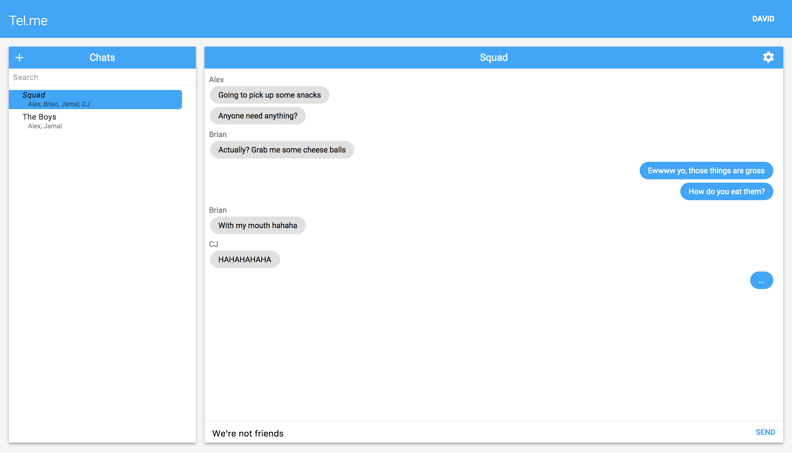

# Tel.me

## Description

A simple websocketed messenger application!

## Getting started

### Install leiningen
Leiningen is the de facto build tool for Clojure. 

Install [leiningen](http://leiningen.org) by following the instructions on this [page](http://leiningen.org).

### Running the project

Run `lein do clean, figwheel`. In another terminal window run `lein run`.

## Contributors

[David Golden](https://github.com/dcgolden)
[Alex Knowlton](https://github.com/AlexKnowlton313)

And a special thanks to our bosses, Mel and Mort, for allowing us to port our code to a stand-alone app.